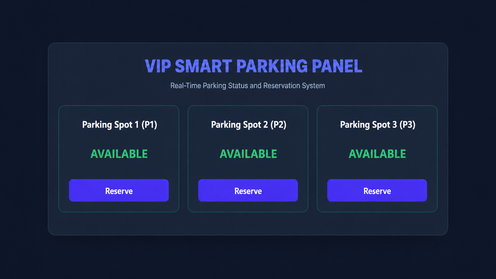
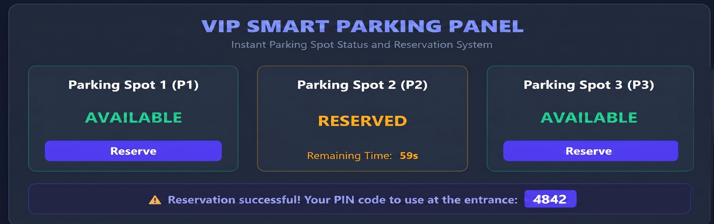
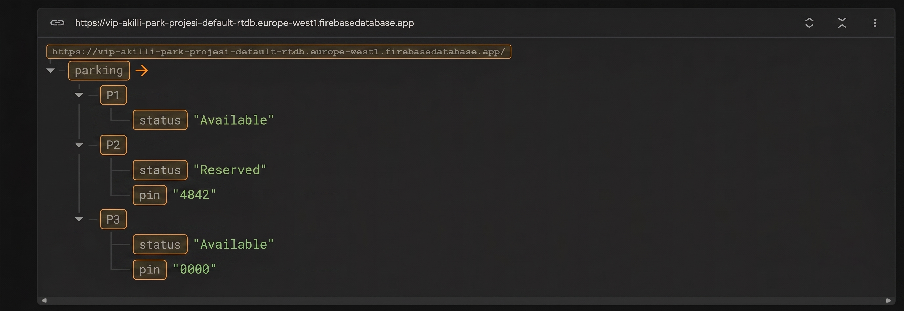
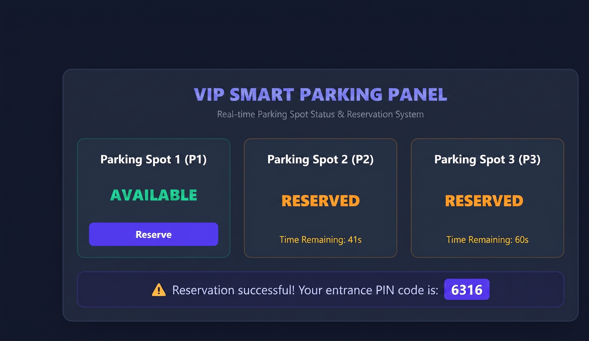
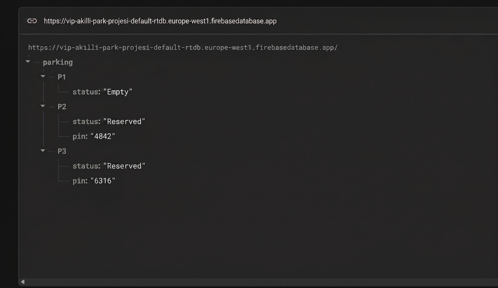

# IoT-Based Smart Parking Management System

ESP32-based smart parking system with real-time occupancy tracking, automated entry/exit barriers, and a web dashboard for remote reservations.

## Features

- **Dual barrier control** — separate entry and exit gates, each with an SG90 servo motor
- **Real-time occupancy detection** — IR sensors at every parking spot
- **Entrance LCD display** — shows the number of available/occupied spots at a glance
- **Per-spot LED status indicators** (WS2812B addressable LED strips): Red = occupied, Green = available, Blue = reserved
- **Web dashboard (Firebase)** — view live spot availability from anywhere
- **Remote reservation system** — users reserve an open spot via the website and receive a unique 4-digit PIN
- **Keypad-based entry** — PIN required only when no unreserved spot remains
- **Automatic misparking correction** — if a driver parks in the wrong reserved spot, the system detects it, flags it visually, and automatically reassigns the affected reservation to a still-open spot so the other driver isn't penalized for someone else's mistake

## How It Works

1. IR sensors continuously monitor occupancy at every spot, synced to Firebase in real time and reflected on the web dashboard and the WS2812B LEDs
2. Users reserve an open spot through the website and receive a 4-digit PIN tied to that specific spot
3. If at least one truly unreserved spot remains, the barrier opens without a PIN; once all remaining spots are occupied or reserved, the LCD requires a PIN before the barrier will open
4. At the barrier, the driver enters their PIN; if it matches an active reservation, the barrier opens
5. The system tracks which spot each entering PIN was assigned to. If the driver then parks in a different reserved spot than their own, the LCD displays a misparking warning, the LED above the wrongly-occupied spot flashes, that spot's status updates to occupied, and the reservation originally tied to it is automatically transferred to the spot the misparked driver was assigned to — so the other driver isn't penalized

## Tech Stack

- ESP32 (Arduino framework, C/C++)
- Google Firebase Realtime Database
- IR sensors (occupancy detection)
- WS2812B addressable LED strips (per-spot status)
- 16x2 LCD display (entrance status)
- 4x3 Keypad (PIN entry)
- 2x SG90 servo motors (entry & exit barriers)

## Web Dashboard Screenshots

## Project Status

Completed as a graduation project.
